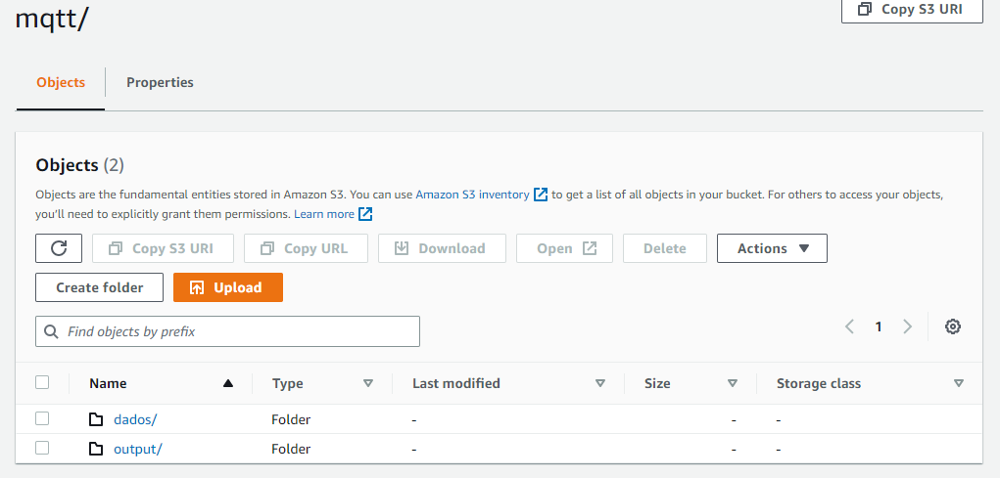

# Simulação do processamento de dados IOT, utilizando o protocolo MQTT
## Introdução
Simulação do processamento de dados de temperatura e umidade, vindos de um dispositivo IOT, através da criação de 2 pipelines e um broker público MQTT. 

Um dos pipelines é criado pelo Streamsets e o outro é feito através de códigos python. E o broker público usado é o HiveMQ.

O pipeline de códigos python consiste em um código que publica os dados no broker e outro que captura os dados, processa e os salva no Amazon S3.

O pipeline feito pelo Streamsets aproveita o código python que publica os dados. Aqui, os dados são capturados e salvos no Amazon S3.

**Tecnologias Usadas**: Python, Docker, Docker-compose, Streamsets, MQTT, Amazon S3

## Preparação e Execução do Projeto

### Dados

Os dados vem do seguinte repositório do Kaggle: https://www.kaggle.com/datasets/johntrunix/home-sensordata. Contém dados de temperatura e umidade medidos de minuto a minuto, ao longo de vários dias.

### Arquitetura

**Broker MQTT**: O broker público MQTT é o HiveMQ que permite criar conexões e tópicos. Com isso, é possível publicar e capturar dados de cada tópico desejado.

**Códigos Python**: Há dois códigos python: publisherMQTT.py e o analizeMQTTdata.py. 

O primeiro lê os dados do arquivo e publica no broker MQTT, uma linha dos dados. O tempo entre a publicação de mensagens, é a diferença entre o time_id da linha de dados sendo lida atualmente e a linha anterior. Isso foi feito para simular um dispositivo IOT.

O segundo script python, captura os dados publicados. Após isso, são feitos dois calculos: a média móvel para temperatura e umidade ao longo de 1 hora. Os resultados são inseridos como novas colunas da tabela e o resultado é salvo no Amazon S3.

**Pipeline Streamsets**: O pipeline feito pelo Streamsets, possui apenas dois blocos. O primeiro deles é a origem, que está inscrito em um tópico MQTT e realiza a captura dos dados. Já o segundo, é o destino que é o Amazon S3.

### Preparação e execução projeto

Para executar o projeto é necessário executar o script os_preparation.sh da seguinte forma:

<code>./os_preparation.sh PASSWORD</code>

Ou, para não expor a senha, é possível ir executando um comando por vez. Esse script prepara o ambiente Linux para a criação dos dois containers Docker.

Depois, é necessário realizar duas ações na AWS. Criação do bucket S3 e geração das chaves AWS.

Para criar o bucket S3, basta clicar em "Create Bucket". No preenchimento dos dados, é necessário em "Block Public Access settings for this bucket", desmarcar as duas últimas opções. O resto dos dados podem ser os padrões. Os prints abaixo, podem ajudar a explicar.

Para criar as chaves, basta clicar em "Security credentials", ir em "Access keys (access key ID and secret access key)" e depois clicar em "Create New Access Key". Com isso, a AWSAccessKeyId e a AWSSecretKey serão criadas e deverão ser baixadas e salvas. Os prints abaixo, podem ajudar a explicar.

Após isso, dentro da pasta /opt/Pipeline_StreamSets, é necessário criar o arquivo .env passando todos os valores importantes.

Com isso, já é possível executar os pipelines. Para isso, basta entrar na pasta do Docker e executar o comando:

<code>docker-compose -f env-docker-compose.yaml up -d</code>

Após um tempo, os scripts python já estarão rodando. Para criar o pipeline no Streamsets, basta entrar no seguinte link:

<code>[seu_ip]:18630</code>

Para facilitar, é possível importar o pipeline que está na pasta streamsets_data. Com o pipeline importado, as únicas informações que faltam são: para o bloco MQTT, são o login e a senha ("User Credentials"), e para o bloco do S3, são a AWSAccessKeyId, a AWSSecretKey e o nome do bucket.

Com isso pronto, é possível executar o pipeline que já irá capturar os dados e salva-los no S3.

